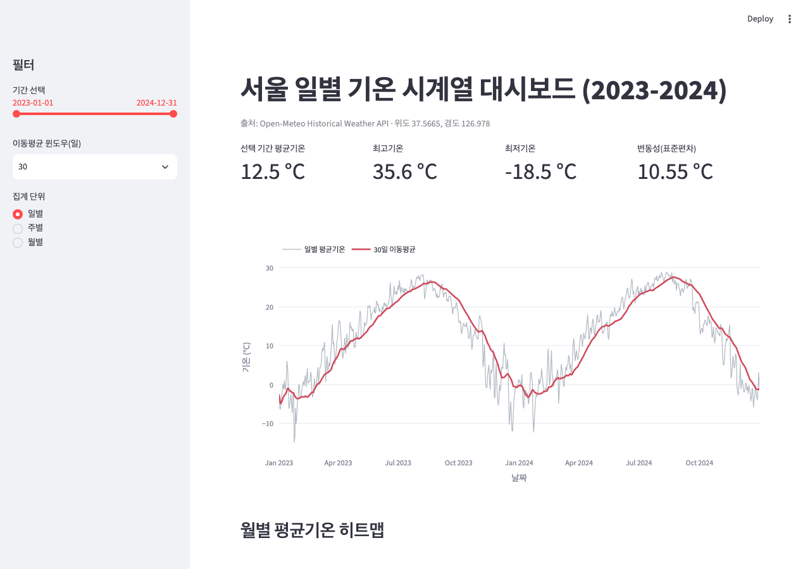
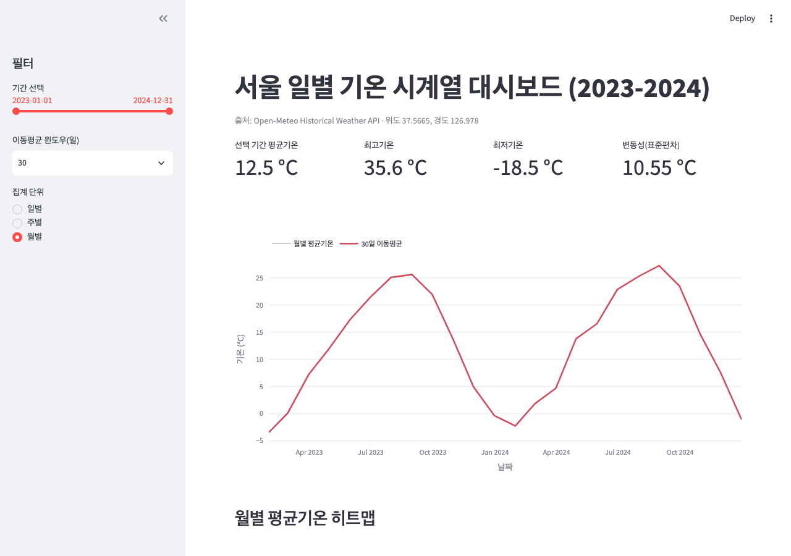
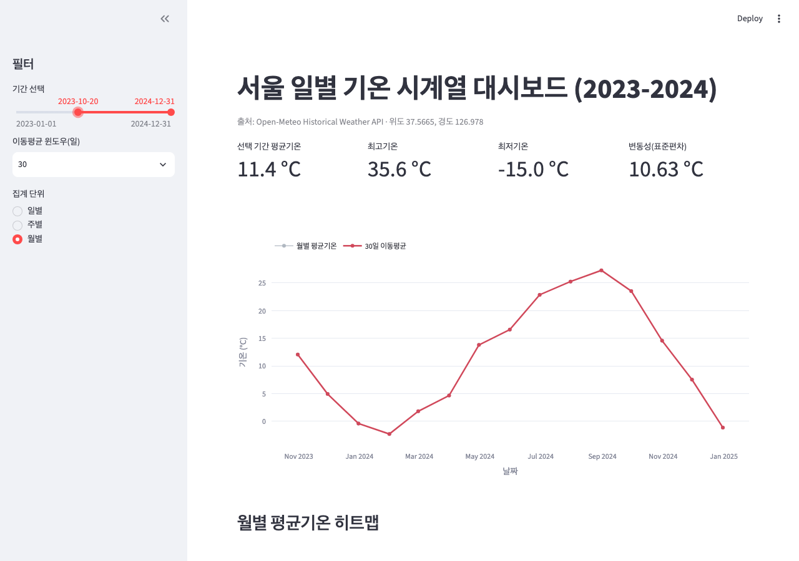
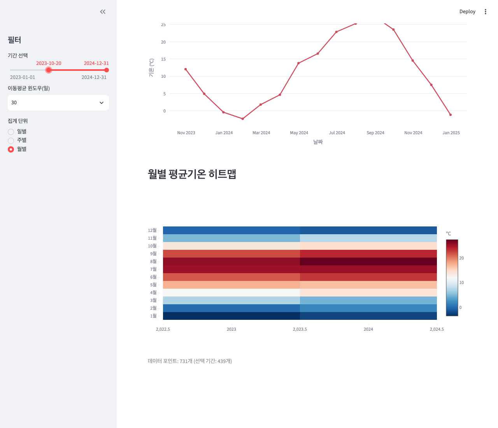
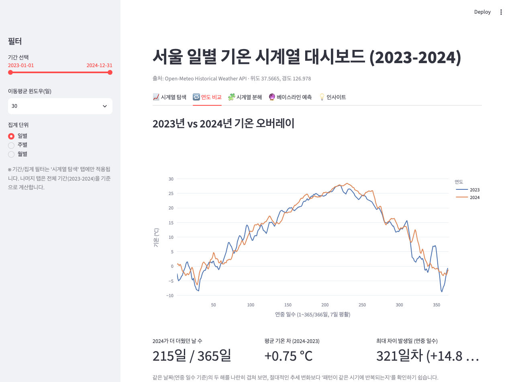
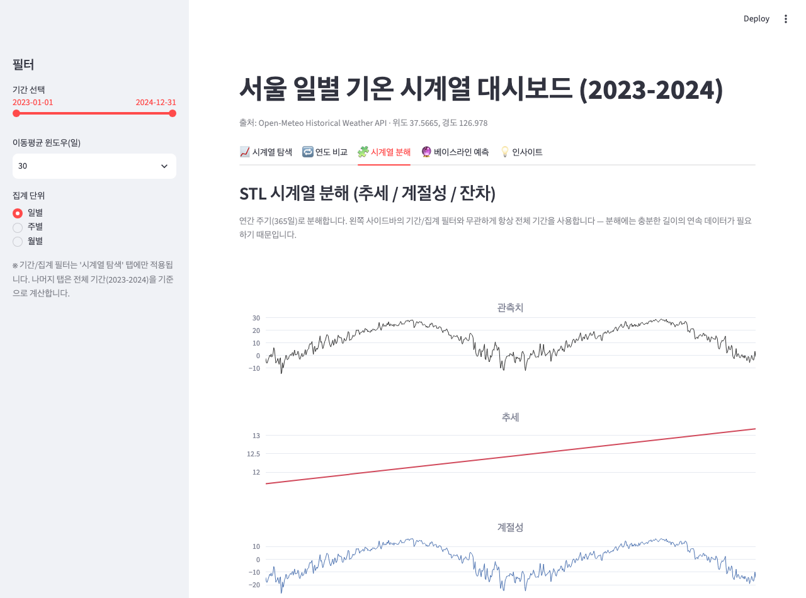
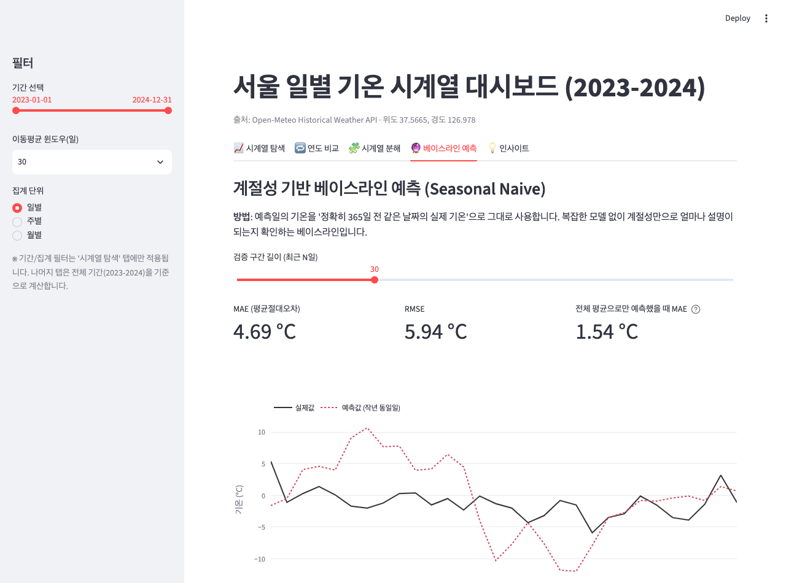
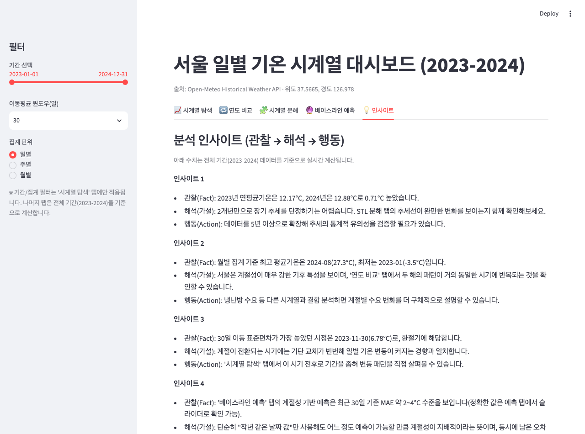

# [보너스] 서울 기온 대시보드 서비스화

REPORT.md의 분석 결과를 기간/집계 단위/이동평균 윈도우를 바꿔가며 직접 탐색할 수 있는 Streamlit 대시보드입니다.

**배포 URL**: https://seoul-temperature-analysis-7mezbcbxgbhqhf5wqueejf.streamlit.app/

## 실행 방법

```bash
pip install -r requirements.txt
streamlit run scripts/dashboard.py
```

브라우저에서 `http://localhost:8501`이 자동으로 열립니다.

## 구성

- **사이드바 필터** (모든 탭 공통 표시, 실제 적용은 '시계열 탐색' 탭에만)
  - 기간 선택 (날짜 범위 슬라이더)
  - 이동평균 윈도우 (7 / 14 / 30 / 60일)
  - 집계 단위 (일별 / 주별 / 월별)
- **탭 5개**
  - 📈 **시계열 탐색**: 선택 기간의 평균/최고/최저기온·변동성 카드, 원데이터+이동평균 그래프, 연×월 히트맵
  - 🔁 **연도 비교**: 2023년과 2024년을 연중 일수(1~365일) 축에 겹쳐서 비교, 두 해의 기온 차 통계
  - 🧩 **시계열 분해**: STL로 관측치를 추세/계절성/잔차로 분해 (전체 기간 고정)
  - 🔮 **베이스라인 예측**: 계절성 나이브 예측(작년 동일일 값 사용)의 MAE/RMSE를 단순 평균 예측과 비교, 검증 구간 길이 슬라이더 제공
  - 💡 **인사이트**: REPORT.md의 인사이트 4개를 전체 기간 데이터로 실시간 재계산해 표시

## 필터/기간 변경 시나리오 (실제 실행 화면 스크린샷)

### 1. 기본 상태 — 전체 기간, 이동평균 30일, 집계 일별


평균기온 12.5°C, 최고 35.6°C, 최저 -18.5°C, 변동성 10.55°C — REPORT.md의 전체 기간 통계와 일치한다.

### 2. 집계 단위를 '월별'로 변경


일별 노이즈 없이 뚜렷한 사인파 형태의 월평균 곡선으로 즉시 재렌더링된다 — 계절성이 더 쉽게 눈에 들어온다.

### 3. 기간을 2023-10-20 ~ 2024-12-31로 축소 (키보드로 시작일 슬라이더 조작)


상단 카드가 평균 11.4°C / 최저 -15.0°C / 변동성 10.63°C로 즉시 재계산된다 — 겨울 구간이 포함되며 최저기온 기록이 갱신되고, 하단 캡션의 "선택 기간" 데이터 포인트 수도 731개→439개로 줄어든다.

### 4. 히트맵으로 연도 비교


8~9월 행이 2024년 열에서 더 짙은 빨간색으로 표시되어, 2024년 여름이 2023년보다 다소 더 더웠음을 한눈에 확인할 수 있다.

모든 스크린샷은 Playwright로 실행 중인 로컬 대시보드(`localhost:8501`)를 직접 조작해 캡처했다 — 슬라이더 키보드 조작, 라디오 버튼 클릭, 스크롤이 실제로 반영된 결과다.

## 추가 탭 (연도 비교 / 시계열 분해 / 베이스라인 예측 / 인사이트)

### 연도 비교


2023년(파랑)과 2024년(주황)을 연중 일수 축에 겹쳐보면 두 해가 거의 같은 시기에 오르내린다는 것을 바로 확인할 수 있다. 상단 카드는 "2024가 더 더웠던 날 수", "평균 기온 차", "최대 차이 발생일"을 실시간으로 계산해 보여준다.

### 시계열 분해 (STL)


관측치를 추세·계절성·잔차 4단 그래프로 나눠 보여준다. 실제 실행 결과 추세는 기간 시작 대비 +1.49°C 상승, 계절성 진폭은 42.7°C로 계산되었다 — REPORT.md의 정적 STL 이미지와 동일한 로직을 대시보드에서 재사용한 것이다.

### 베이스라인 예측


"작년 동일 날짜 값을 그대로 예측치로 쓴다"는 가장 단순한 계절 나이브 방법을 최근 N일(슬라이더로 조절)에 대해 검증한다. 실제 실행 결과 최근 30일 기준 MAE 4.69°C, RMSE 5.94°C였고, 참고용 "단순 평균 예측" MAE(1.54°C)보다 오히려 높게 나왔다 — 이 구간에서는 계절성 정보만으로는 부족했다는 뜻이며, 화면 하단에 그 해석과 방법의 가정·한계를 함께 서술한다. (미션의 "시계열 심화 옵션 B: 간단 예측"에 해당)

### 인사이트


REPORT.md의 인사이트 4개(관찰→해석→행동)를 전체 기간 데이터로 매번 다시 계산해서 보여준다 — 데이터가 바뀌어도 수치가 자동으로 갱신된다.

## 배포 (Streamlit Community Cloud)

무료로 공개 URL을 받을 수 있는 가장 간단한 방법입니다. GitHub 로그인이 필요한 단계라 사용자가 직접 진행해야 합니다.

1. https://share.streamlit.io 접속 후 GitHub 계정으로 로그인
2. **New app** 클릭
3. Repository: `gamercross/seoul-temperature-analysis`, Branch: `main`, Main file path: `scripts/dashboard.py` 입력
4. **Deploy** 클릭 → 1~2분 뒤 `https://<app-name>.streamlit.app` 형태의 공개 URL 생성
5. 이후 `main`에 새 커밋이 머지될 때마다 자동으로 재배포됨

레포에 있는 `runtime.txt`(Python 3.11 고정)와 `requirements.txt`를 그대로 사용하므로 별도 설정 없이 바로 배포된다.

> **배포 URL**: https://seoul-temperature-analysis-7mezbcbxgbhqhf5wqueejf.streamlit.app/

## 알아둘 점

- `slider`로 고른 날짜 범위 밖 데이터는 카드/그래프 계산에서 완전히 제외됩니다(부분 포함 없음).
- 월별/주별 집계 시 이동평균 윈도우는 원래 일 단위 값을 해당 집계 단위로 나눈 근사치를 사용합니다(예: 30일 윈도우 → 월별 집계에서는 1개월 윈도우).
- 히트맵은 필터와 무관하게 항상 전체 기간(2023-2024) 기준으로 고정 표시됩니다 — 연도 간 비교를 위한 별도 뷰이기 때문입니다.
