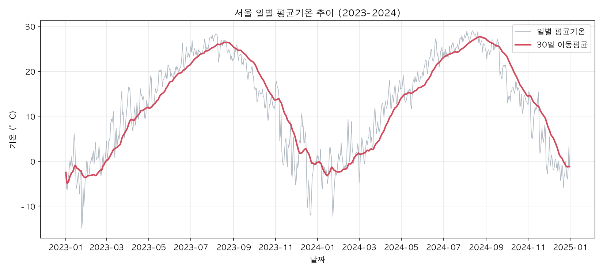
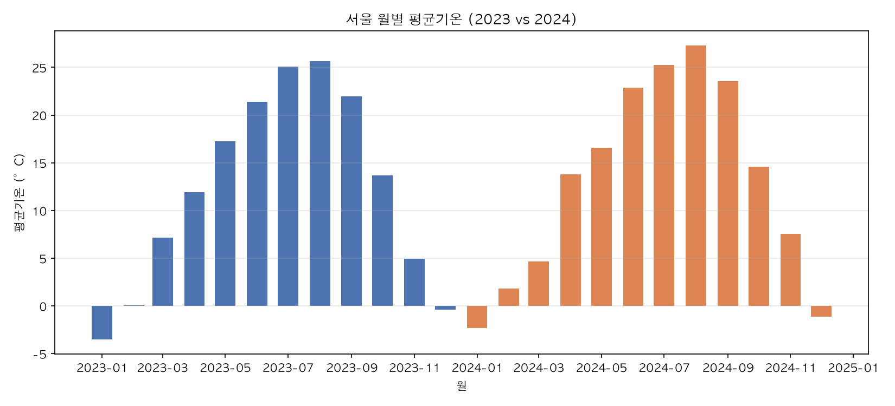
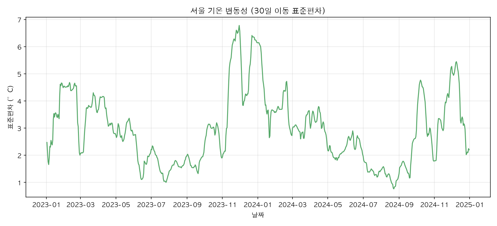
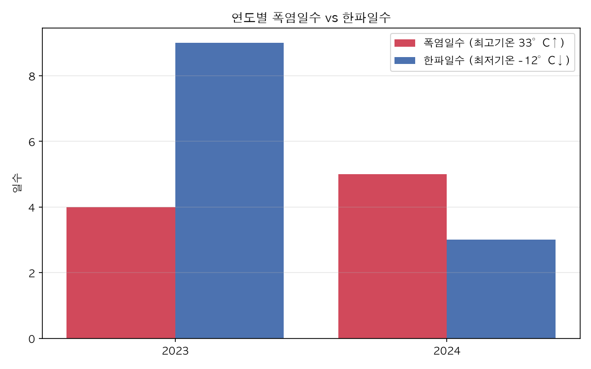
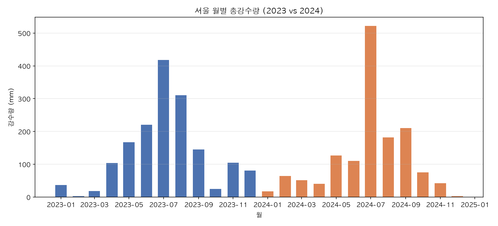
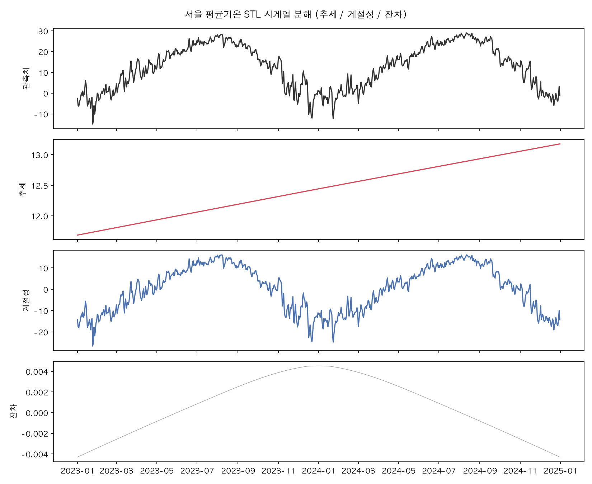

# 서울 2023~2024년 일별 기온 시계열 분석 리포트

## 1. 분석 주제 및 선정 이유

서울의 일별 기온 데이터를 통해 2년간(2023~2024) 기온의 추세, 계절성, 변동성을 확인하고, 그래프에서 관찰한 사실과 그에 대한 해석을 구분해 서술한다. 기온은 계절성이 뚜렷해 이동평균·시계열 분해 같은 기법의 효과를 직관적으로 확인할 수 있는 주제다.

## 2. 분석 질문 (3개 이상)

1. 2023년과 2024년 사이에 전체적인 기온 상승/하락 추세가 있었는가? (그래프로 확인 가능)
2. 계절에 따라 기온과 그 변동성(일교차/변동폭)은 어떻게 달라지는가? (그래프로 확인 가능)
3. 기온 변동성이 가장 커지는 시기는 언제이며, 그 원인은 무엇으로 추정할 수 있는가? (추가 해석 필요)
4. 연간 계절성을 제거하면 순수한 추세만으로도 온도 상승 신호를 확인할 수 있는가? (추가 해석 필요, 보너스 STL 분해로 확인)
5. 폭염/한파 같은 극단적인 날은 두 해 사이에 얼마나 차이가 났고, 강수 패턴은 어떻게 달랐는가? (추가 해석 필요)

## 3. 데이터 설명

- **출처**: [Open-Meteo Historical Weather API](https://open-meteo.com/) (무료, API 키 불필요, CC BY 4.0)
- **좌표**: 서울 (위도 37.5665, 경도 126.978)
- **기간**: 2023-01-01 ~ 2024-12-31 (731일)
- **컬럼**: `date`, `temp_max`, `temp_min`, `temp_mean`(일평균기온, °C), `precipitation`(일강수량, mm)
- **결측치/이상치 처리**: 원본 API 응답에는 결측치가 없었다(731행 전부 존재). 재현성을 위해 전체 날짜 범위로 재색인한 뒤 결측이 있으면 선형보간으로 채우는 로직을 넣었으나 실제로는 채울 결측이 0건이었다. 이상치는 IQR 기준(`[Q1-1.5·IQR, Q3+1.5·IQR]` = [-27.0°C, 52.1°C])으로 점검했고, 이 범위를 벗어난 값은 없어 제거하지 않았다 — 계절적 극값(한파/폭염)은 실제 현상이므로 이상치로 취급하지 않는 것이 타당하다고 판단했다.
- **적용한 시계열 분석 기법**: ① 7일/30일 이동평균, ② 전일 대비 변화량(일별 변화율), ③ 30일 이동 표준편차(변동성), ④ 월별 집계(평균/표준편차/최대/최소), ⑤ 임계값 기반 이벤트 카운트(폭염일수·한파일수·강수일수). 보너스로 STL 분해(추세/계절성/잔차)와 베이스라인 예측(계절 나이브)도 수행했다.

## 4. 분석 결과 및 시각화

### 4-1. 일별 평균기온 추이 + 30일 이동평균


일별 값(회색)은 등락이 크지만, 30일 이동평균(빨간선)은 뚜렷한 사인파 형태의 계절 패턴을 보인다. 두 번의 여름 피크(2023-08, 2024-08)와 두 번의 겨울 저점(2023-01, 2024-01)이 명확히 구분된다.

### 4-2. 월별 평균기온 (2023 vs 2024, 계절성)


월 단위로 집계하니 여름·겨울 사이의 대비가 더 뚜렷하게 드러난다. 일 단위 그래프에서는 노이즈에 묻혀 보이지 않던 "몇 월이 실제로 더 더웠는지/더 추웠는지" 비교가 쉬워졌다 — 이 미션의 가이드대로 집계 단위를 월로 바꾼 이유다.

### 4-3. 기온 변동성 (30일 이동 표준편차)


여름·겨울 한가운데보다 계절이 바뀌는 환절기(3월, 11월경)에 변동성이 튀어 오르는 구간이 반복적으로 나타난다.

### 4-4. 연도별 폭염일수 vs 한파일수


기상청 기준(폭염 33°C↑, 한파 -12°C↓)으로 센 결과, 폭염일수는 2023년 4일 → 2024년 5일로 비슷했지만 한파일수는 2023년 9일 → 2024년 3일로 크게 줄었다.

### 4-5. 월별 총강수량 (2023 vs 2024)


2024년 7월 강수량이 약 522mm로 두 해를 통틀어 가장 많았고, 같은 시기 2023년(약 419mm)보다도 뚜렷하게 많았다. 전체 총강수량은 2023년 1632mm, 2024년 1444mm로 오히려 2024년이 더 적었다 — 즉 2024년은 "총량은 적지만 특정 달에 몰아서" 내린 해였다.

### 4-6. [보너스] STL 시계열 분해 (추세/계절성/잔차)


연간 주기(365일)로 분해한 결과, 계절성(3번째 패널)이 진폭 약 ±17°C로 데이터 변동의 대부분을 설명하고, 추세(2번째 패널)는 완만하게 우상향한다. 잔차(4번째 패널)는 특정 구간(환절기)에서 커지는데, 이는 계절 모델로 설명되지 않는 단기 이상 기상(한파, 이상고온 등)을 반영한다.

## 5. 인사이트 (3개 이상, 관찰-해석-행동 구조)

**인사이트 1**
- 관찰(Fact): 2023년 연평균기온은 12.17°C, 2024년은 12.88°C로 0.71°C 높았다.
- 해석(가설): 단순 2개년 비교로 장기 온난화 추세라고 단정하기는 어렵다. 2024년이 우연히 더 더웠던 해일 수도 있고, 기후변화로 인한 상승 추세의 일부일 수도 있다. STL 분해의 추세선이 완만한 우상향을 보이는 점은 후자를 약하게 지지하지만, 3~5년 이상의 데이터가 있어야 통계적으로 신뢰할 수 있다.
- 행동(Action): 데이터를 5년 이상으로 확장해 연도별 평균을 다시 비교하고, 추세의 통계적 유의성(예: 선형회귀 기울기의 p-value)을 검증해볼 필요가 있다.

**인사이트 2**
- 관찰(Fact): 월별 집계 기준 최고 평균기온은 2024년 8월(27.27°C), 최저는 2023년 1월(-3.5°C)로 연간 진폭이 약 31°C에 달한다.
- 해석(가설): 서울은 계절성이 매우 강한 대륙성 기후 특성을 보이며, 이 진폭은 냉난방 수요나 에너지 소비 패턴과 밀접하게 연관될 가능성이 높다.
- 행동(Action): 전력 사용량 등 다른 시계열과 결합 분석하면 "몇 월에 냉난방 수요가 급증하는가"를 더 구체적으로 설명할 수 있을 것이다.

**인사이트 3**
- 관찰(Fact): 30일 이동 표준편차가 가장 높았던 시점은 2023-11-30(6.78°C)로, 늦가을~초겨울 환절기에 해당한다.
- 해석(가설): 계절이 전환되는 시기에는 기단 교체가 빈번해 일별 기온 변동이 커지는 경향이 있다는 기상학적 통념과 일치한다. 반면 여름·겨울 한가운데는 기단이 안정적이라 변동성이 낮다.
- 행동(Action): 환절기 변동성 급증 구간을 자동으로 탐지하는 규칙(예: 30일 표준편차가 특정 임계값을 넘으면 알림)을 만들면 계절 전환 시점을 데이터 기반으로 조기에 파악할 수 있다.

**인사이트 4**
- 관찰(Fact): 겨울철(2023-12~2024-02) 평균기온은 -0.34°C였고, 같은 기간 전일 대비 변화량의 표준편차는 2.23°C로 연간 전체와 큰 차이가 없었다.
- 해석(가설): 겨울이 평균적으로 더 춥다는 것과 별개로, 겨울철 하루하루의 기온 변화 폭 자체는 다른 계절과 비교해 유난히 크거나 작지 않다는 뜻이다. 즉 "겨울은 날씨가 변덕스럽다"는 인상은 절대 기온이 낮아 체감이 크게 느껴지는 것일 수 있다.
- 행동(Action): 체감 변동성과 실제 통계적 변동성의 차이를 구분해 설명하는 것이 데이터 기반 커뮤니케이션에서 중요하다는 점을 확인했다.

**인사이트 5**
- 관찰(Fact): 한파일수는 2023년 9일에서 2024년 3일로 3분의 1 수준으로 줄었지만, 폭염일수는 4일→5일로 큰 변화가 없었다. 총강수량은 2023년 1632mm에서 2024년 1444mm로 줄었는데도, 2024년 7월 한 달 강수량(약 522mm)은 두 해 중 가장 많았다.
- 해석(가설): 2024년이 전반적으로 더 따뜻했다는 인사이트 1의 관찰과 일치하는 방향으로, 특히 겨울 쪽(한파일수 급감)에서 그 차이가 크게 나타난다. 강수는 총량보다 특정 시기(2024년 여름 장마철)에 집중되는 경향이 강해진 것으로 보이는데, 이는 두 해 비교만으로는 일반적인 패턴인지 2024년의 특이 현상인지 구분하기 어렵다.
- 행동(Action): 여러 해의 7월 강수량을 비교해 2024년 7월이 이상치인지, 최근 집중호우 경향이 반복되는 패턴인지 확인이 필요하다.

## 6. 결론 및 한계점

**결론**: 서울의 2023~2024년 기온은 뚜렷한 연간 계절성(진폭 약 31°C)을 가지며, 이동평균과 월별 집계로 그 패턴이 선명하게 드러난다. 2024년이 2023년보다 소폭 더 더웠고, 기온 변동성은 여름·겨울 중심부보다 환절기에 커지는 경향이 확인됐다. STL 분해 결과 추세는 완만한 우상향을 보였다. 임계값 기반으로 봐도 2024년은 한파일수가 크게 줄어 "따뜻해진 해"라는 결론과 방향이 일치했고, 강수는 총량보다 특정 시기(2024년 7월)에 집중되는 모습을 보였다.

**한계점**:
- 데이터가 2년치(731일)로 짧아 "온난화 추세"를 통계적으로 검증하기에는 부족하다.
- 단일 관측 지점(서울) 데이터만 사용해 지역적 특수성을 배제할 수 없다.
- 외부 변수(도시화, 엘니뇨/라니냐 등 대기 순환 패턴)를 반영하지 않아 원인 해석은 가설 수준에 머문다.
- 이상치를 전혀 제거하지 않았기 때문에, 실제 관측 오류(센서 오류 등)가 있었다면 결과에 영향을 줄 수 있다(다만 Open-Meteo 데이터는 재분석 모델 기반이라 극단적 관측 오류 가능성은 낮다).

## 7. AI 사용 로그

| 사용 작업 | 사용 이유 | 검증 방법 |
|---|---|---|
| 데이터 수집 스크립트(`fetch_data.py`) 작성 | Open-Meteo API 파라미터 구조를 빠르게 파악하고 반복 작업 없이 수집 코드를 작성하기 위해 시간 절감 | 실제로 API를 호출해 731행이 정확히 반환되는지, 컬럼과 기간이 요청과 일치하는지 직접 확인 |
| 시계열 분석 코드(이동평균/변동성/월별집계/STL) 작성 | 표준적인 pandas/statsmodels 패턴을 빠르게 적용하기 위한 대안 탐색 | 계산된 수치(연평균, 최고/최저 월, 변동성 최고 시점)를 직접 출력해 육안으로 타당성 검토, STL 계절성 진폭이 실제 여름-겨울 온도차와 비슷한 규모인지 대조 |
| 인사이트 문장 다듬기 | 관찰과 해석을 명확히 분리해 서술하기 위한 표현 정리 | 각 인사이트의 "관찰" 문장에 적힌 수치가 스크립트 출력값과 정확히 일치하는지 재대조(샘플링 체크) |

## 8. [보너스] 대시보드 서비스화

기간/이동평균 윈도우/집계 단위를 바꿔가며 위 분석을 직접 탐색할 수 있는 Streamlit 대시보드를 배포했다 (https://seoul-temperature-analysis-7mezbcbxgbhqhf5wqueejf.streamlit.app/). 시계열 탐색 외에도 연도 비교, STL 분해, 베이스라인 예측(계절 나이브), 인사이트 탭을 인터랙티브하게 제공한다. 실행 방법과 탭별 스크린샷은 [DASHBOARD.md](DASHBOARD.md)에 정리했다.

## 9. 재현 방법

```bash
pip install -r requirements.txt
python3 scripts/fetch_data.py     # data/seoul_daily_temperature_2023_2024.csv 생성
python3 scripts/analysis.py       # images/*.png 6개 생성 + 인사이트 수치 출력
```

- Python 3.10 이상
- 의존성: `requirements.txt` 참고 (pandas, numpy, matplotlib, requests, statsmodels)
- 데이터 라이선스: Open-Meteo는 CC BY 4.0으로 제공되며, 출처 표기 시 재사용 가능
